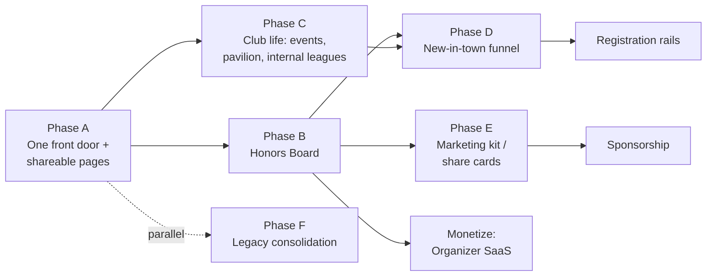

# TossUp — Product Review, Adoption Plan & Monetization Strategy (refined)

## Context

TossUp has a solid tournament-hosting spine (create → register teams → fixtures → results → auto-standings via the `tournament_standings` view → Pavilion comms), a hardened Person-based identity model (`player_profiles` + user link + merge + admin link), and a distinctive light "clubhouse" design system. Goal: **get league organizers and local cricket clubs to adopt it** — not by competing on deep match management/scorecards, but by nailing:

1. **The honors tally** — which cups a club won, in which year, under whose captaincy, with which squad.
2. **Newcomer discovery** — someone new in town finds recreational play, joins a club, attends events/practice/internal leagues.
3. **Social presence made easy** — organizers/club hosts get a shareable public face without running a website.

Deliverable: (a) product review findings, (b) a phased build roadmap, (c) a monetization strategy — **US/diaspora metros first, organizer-SaaS-led**, with registration fees, sponsorship, and player premium layered in later phases. On approval, this document is committed as `docs/PRODUCT_PLAN.md` (the root `docs/` directory does not exist yet — create it) and a new `docs/BACKLOG.md` is created (no backlog file exists today), then execution starts with Phase A.

All findings below were verified against the codebase (2026-07-07 audit).

---

## Part 1 — Review findings (verified against the codebase)

### Strengths (keep, build on)
- **Tournament hosting is the most complete platform feature**: `web/src/app/tournaments/[id]/manage/page.tsx` (client component driven by `src/lib/platform/tournament-host.ts`) has registration approval (via the `approve_registration` SECURITY DEFINER fn), team/fixture CRUD, results, auto-standings (`tournament_standings` security-invoker view), and the Pavilion (`components/platform/Pavilion.tsx`). A genuine "replace the WhatsApp group" wedge.
- **Identity model** (`player_profiles` as Person + phase0–5 migrations: auth-self person, tombstone, memberships, merge, roster RLS, link-member-to-user) solves the real grassroots problem: rosters full of people who never sign up. CricHeroes-class apps force every player to install the app; TossUp doesn't.
- **Recognition tiers + reputation columns**: `recognition_tier` + `reputation_score` exist on clubs, leagues, and player_profiles; `/discover` queries (`src/lib/platform/queries.ts`) already order by `reputation_score` and filter `is_recruiting` / `looking_for_club`. A trust system ready to power discovery ranking.
- **Design language** is consistent and ownable (off-white `#f5f4ef`, green `#1f9d57`, `cy-*` classes, cricket-ball motif, tier-colored card edges via `recognition.ts` + `globals.css`).

### Gaps that block club/organizer adoption (ranked)
1. **Clubs are second-class.** `club/[slug]/page.tsx` shows a member *count* (`countClubMembers`) but no roster, no history, no trophies, no feed, no events. Manage page is roster-only. A club host gets almost nothing to show off.
2. **No honors/seasons model.** No trophies table anywhere in `web/supabase/migrations/`; no champion recorded when a tournament ends (`leagues.registration_status` is only OPEN/CLOSED/UPCOMING — there is no "concluded" state or champion column); `season` is free text on `leagues`. The most-requested artifact ("we won the 2024 cup under X's captaincy") cannot be represented.
3. **Events/practice scheduling is stranded on the legacy DB.** `club_events`/`event_rsvps` exist only in `web/supabase/legacy-auction-migrations/20260226010000_add_club_events_schema.sql`, with working API routes (`/api/clubs/[id]/events*`), Zod schemas (`lib/validations/event.ts`), and components (`components/events/EventCard|EventForm|EventList.tsx`) — all against the *legacy auction project*, invisible from platform surfaces. The platform DB has no events tables.
4. **Zero shareability on platform routes.** `generateMetadata` exists only on legacy routes (`tournament/[id]`, `explore/club/[slug]`); none of `club/[slug]`, `player/[id]`, `tournaments/[id]`, `/discover` have metadata or OG images, and there are no share buttons. WhatsApp pastes preview as bare links — this kills the organic growth loop.
5. **Two front doors.** `src/app/page.tsx` is dark-themed, `'use client'`, wired to the **legacy** Supabase project via raw `createBrowserClient(NEXT_PUBLIC_SUPABASE_URL…)`, and funnels to the auction product. Auth state on the landing header and the platform header (`PlatformAuthNav`) come from *different projects*. There are also parallel route trees: platform `club/[slug]`+`tournaments/[id]` vs legacy `clubs/`, `leagues/`, `explore/`, `tournament/[id]`, `dashboard/`.
6. **IA holes**: no `/tournaments` index route (only `/tournaments/new` and `/tournaments/[id]` exist — the index 404s); `PlatformShell` nav has only "Discover" and "Host" — no Clubs/Tournaments/Players links, no "Start a club" CTA parity.
7. **Plumbed-but-dead systems**: `reputation_score` has no scoring engine (static default 0); CricHeroes ingestion is schema-only (`external_sources`/`external_links`/`ingested_results` in `20260620030000`, zero application code); notifications/`EVENT_REMINDER` exist only on the legacy project.

---

## Part 2 — Product roadmap (phased; each phase = shippable PRs)



### Phase A — "One front door + shareable pages" (foundation, ~1 week of PRs)
Cheapest, highest-leverage. Everything later compounds through sharing.
- **A1. Re-point the landing page at the platform.** Rewrite `src/app/page.tsx` as a server component in the clubhouse theme + `PlatformShell`, hero = "Find your cricket club" / "Host your league", CTAs → `/discover`, `/club/new`, `/tournaments/new`. Auction becomes a footer/"Tools" link. This removes the legacy-Supabase auth call from the landing page entirely (platform auth chrome comes free with `PlatformAuthNav` inside the shell).
- **A2. IA fixes**: add `/tournaments` index page (browse + filters, reuse `listTournaments` from `queries.ts` and `components/platform/TournamentCard.tsx`, mirroring `/discover`'s structure); add **Clubs / Tournaments / Players** links to `PlatformShell` nav (Clubs/Players can deep-link to `/discover?tab=`); add "Start a club" CTA parity with "Host".
- **A3. OG metadata**: `generateMetadata` on `club/[slug]`, `player/[id]`, `tournaments/[id]`, `/discover` — title, description, plus dynamic OG images via `next/og` `opengraph-image.tsx` colocated per route (club crest/tier/city; tournament name/dates/standings leader). Pattern reference: legacy `tournament/[id]/page.tsx` already exports `generateMetadata`. Note: `club/[slug]` and `tournaments/[id]` pages are `force-dynamic` server components, so metadata can reuse the same query helpers (`getClubBySlug`, `getTournament`).
- **A4. Share affordances**: small `ShareButton` client component (Web Share API + copy-link fallback + WhatsApp deep link `https://wa.me/?text=`) on club/tournament/player heroes and `MatchCard` results.

### Phase B — "The Honors Board" (the named differentiator)
New platform migration (in `web/supabase/migrations/`, `YYYYMMDDHHMMSS_honors.sql`). **No seasons table** (YAGNI — `year int` + optional `season_label` covers it):
```
honors (
  id uuid pk,
  club_id uuid not null → clubs,        -- whose cabinet it sits in
  team_id uuid null → teams,
  league_id uuid null → leagues,        -- link when hosted on TossUp
  title text not null,                  -- "Bay Area Premier League — Champions"
  result text not null default 'CHAMPION'
    check (result in ('CHAMPION','RUNNER_UP','THIRD','SPECIAL')),
  year int not null, season_label text null,
  captain_person_id uuid null → player_profiles,
  notes text null, photo_url text null,
  source text not null default 'SELF_REPORTED'
    check (source in ('SELF_REPORTED','TOSSUP_VERIFIED')),
  created_by uuid null → users, created_at timestamptz
)
honor_squad_members (honor_id → honors, person_id → player_profiles, role_label text null,
                     pk (honor_id, person_id))
```
Same migration also adds tournament conclusion state to `leagues`: `concluded_at timestamptz`, `champion_team_id uuid → tournament_teams`, `runner_up_team_id uuid → tournament_teams`.
- RLS: public read gated on club visibility (mirror `phase5_club_roster_rls.sql` policies); writes via `is_scope_admin('club', club_id)`. `TOSSUP_VERIFIED` rows only writable by the conclude function (below), never directly.
- **B1. Club "Trophy Cabinet"** on `club/[slug]`: honors grouped by year, gold-accent cards (`#f4c430` from the tier palette), captain + squad chips linking to `player/[id]`. Empty state sells it: "Add your club's first trophy."
- **B2. Manage UI** on `club/[slug]/manage`: add-honor form (title, year, result, captain picker from roster, squad multi-pick from roster, photo URL) following the existing club-admin client pattern (`src/lib/platform/club-admin.ts`). Captain and squad are Persons — account-less legends count, and merge/link keeps history intact.
- **B3. "Conclude tournament"** on `tournaments/[id]/manage`: pick champion + runner-up (default from standings), stamps `leagues.concluded_at`/`champion_team_id`/`runner_up_team_id` and auto-writes `TOSSUP_VERIFIED` honors into the winning teams' clubs' cabinets (via `tournament_teams.club_id`, skipping teams without a linked club). Implement as a SECURITY DEFINER function `conclude_tournament(league_id, champion_team_id, runner_up_team_id)` mirroring the existing `approve_registration` fn pattern (`20260624140000_approve_registration_fn.sql`), called from `tournament-host.ts`. Tournament page gets a champions banner when `concluded_at` is set. This is the flywheel: hosting on TossUp → verified silverware → clubs want their cabinet here.
- **B4. Player honors ribbon** on `player/[id]`: honors where the Person is captain or in `honor_squad_members` ("🏆 Champion 2024 — as captain").

### Phase C — "Club life": events, pavilion, internal leagues (port to platform DB)
- **C1. Port events to the platform project**: new migration for `club_events` + `event_rsvps` — RSVP keyed by `person_id → player_profiles` (with `user_id` convenience column), statuses GOING/MAYBE/NOT_GOING, types PRACTICE/MATCH/SOCIAL/OTHER. RLS: member read (public for PUBLIC clubs), `is_scope_admin` write, member RSVP-own-row. Reuse the legacy Zod shapes (`lib/validations/event.ts`) and restyle `EventCard/EventForm/EventList` to clubhouse. Data access follows the platform pattern (client lib against `platformDb` + RLS, like `club-admin.ts`), **not** the legacy API-route pattern.
- **C2. Club page "Upcoming" section** + full `/club/[slug]/events` list; manage page gets event CRUD; RSVP counts on cards.
- **C3. Internal leagues, cheaply**: `leagues.club_id` already exists — add "Start an internal league" button on club manage that pre-fills `club_id` + PRIVATE visibility in the existing `/tournaments/new` flow. Practice matches = fixtures inside it. **No new engine.**
- **C4. Club Pavilion**: `tournament_posts.league_id` is currently `NOT NULL` — migration must `ALTER COLUMN league_id DROP NOT NULL`, add nullable `club_id → clubs`, and add a one-of check (`(league_id IS NULL) <> (club_id IS NULL)`), plus club-scoped RLS and an index on `club_id`. Reuse `Pavilion.tsx` with a scope prop (league vs club). Gives clubs announcements/discussion — the "club WhatsApp group" replacement.
- **C5. ICS export** (`/api/clubs/[id]/events.ics`, plain-text ICS generation, no dependency) so events land in calendars; email digest deferred.

### Phase D — "New in town" funnel (discovery depth)
- **D1. Onboarding wizard** at `/start` (linked from the new landing): "I just moved / I want to play" → city + role + availability → creates `player_profiles` with `looking_for_club=true` (reuse `/player/new` internals) → shows matching recruiting clubs (geo via existing `km_between` fn) + upcoming public events.
- **D2. Join requests**: "Ask to join" on club page → new `club_join_requests` table (person_id, club_id, message, status) + admin approve → writes `club_memberships`. (Legacy JoinClubButton targets the wrong DB — build fresh on the platform pattern.)
- **D3. Recruiting board on `/discover`**: surface `is_recruiting` clubs and `looking_for_club` players to each other (filters already exist in `queries.ts` — this is UI surfacing, not new queries).
- **D4. Reputation v1**: computed score = activity (fixtures completed, events held, honors count, roster size, profile completeness) via a nightly pg_cron/edge function updating `reputation_score`. `/discover` ranking already consumes the column — no frontend change.

### Phase E — "Social presence made easy" (organizer marketing kit)
- **E1. Result cards**: branded 1080×1080 share image per completed fixture (next/og route handler) — teams, scores, margin, tournament name, sponsor strip — one tap → WhatsApp/Instagram. Same for "Champions" (from B3) and "Fixture announced".
- **E2. Club microsite polish**: crest upload (Supabase Storage on the platform project), cover photo, custom accent color, About + Honors + Events + Roster — the club page *is* their website; optional `?embed=` widget mode.
- **E3. Follow (lightweight)**: `follows` table (user → club/league) powering a personal `/home` feed of events/results/announcements; email digest hangs off this later.

### Phase F — Consolidation & platform hygiene (parallel/background)
- Redirect legacy routes to platform equivalents as they reach parity: `/explore` + `/explore/club/[slug]` → `/discover` + `/club/[slug]`; `/tournament/[id]` → `/tournaments/[id]`; `/clubs`, `/leagues`, `/dashboard` → platform pages once C-phase features close the gap. Ends the two-front-doors problem.
- Auction kept as-is, repositioned as a premium organizer tool ("Player auction night" module) linked from tournament manage.
- Notifications table on the platform project (bell + event-reminder producer via pg_cron/edge function).
- CricHeroes ingestion stays parked (schema ready) until a concrete league asks — **do not build speculatively**.

---

## Part 3 — Monetization strategy (US/diaspora metros first)

### Positioning
"**The public face + trophy shelf of your cricket club — and the easiest way to run your league.**" Players and viewers always free (they *are* the SEO/network). Charge the two actors with budgets: club admins and league organizers — both already pay for WhatsApp-taped-together alternatives (websites, Google Forms, Playpass, LeagueLobster).

### Revenue ladder (phases match the roadmap)
1. **Organizer SaaS (lead, from Phase B/C ship)**
   - **Free**: club page, roster ≤ 25, honors ≤ 5 entries, 1 active tournament, 10 events/season, community tier badge.
   - **Club Pro — $19/mo or $149/yr**: unlimited roster/honors/events, crest + custom accent, club Pavilion, ICS/calendar, priority placement in /discover, verified-review fast-track.
   - **League Pro — $39/tournament or $299/yr organizer plan**: unlimited teams, registrations with custom questions, result share-cards with *their* branding + sponsor strip, pinned/urgent Pavilion posts, exportable standings, multiple co-admins.
   - Season-aligned annual pricing as default (cricket is seasonal — bill yearly).
2. **Registration & dues rails (Phase D+, Stripe Connect)**: paid tournament registration + club dues; platform fee **2.9% Stripe + 2% TossUp (min $1)**, fee-free on Pro up to a cap — makes Pro obviously worth it for any league charging $100+/team.
3. **Sponsorship/ads (once metro density exists)**: sponsor slots on league pages + result cards ($50–250/season, organizer keeps 70% if they sell it); featured listings for academies/gear stores on /discover city pages.
4. **Player premium (last, network-dependent)**: $3–5/mo verified profile, photo gallery, cross-club career honors timeline. Don't build before Phases B–D create data worth paying for.

### Go-to-market (diaspora metros)
- **Seed 10–20 leagues, not 1,000 clubs.** One league organizer onboards 8–16 clubs and 100–200 players; the "conclude tournament → verified honors" loop then pulls clubs to claim pages.
- **The WhatsApp share card is the growth channel.** Every OG card and result image carries "made with TossUp" + link — this is why Phases A/E precede paid acquisition.
- Target metros: SF Bay Area, Seattle, Dallas, Atlanta, NJ/NYC, Toronto. First season free ("Founding League" badge = OFFICIAL-tier recognition), convert at season 2.
- Success metrics: # tournaments concluded on-platform, # honors entries, share-card CTR → signups, % clubs with ≥1 event/month, free→Pro conversion at season boundary.

---

## Execution notes (repo-mechanical)

- All new tables → platform migrations in `web/supabase/migrations/` (`YYYYMMDDHHMMSS_*.sql`), target project `byuvtmfarlreoxilrzcx` (tossup-cricket). Never touch `legacy-auction-migrations/`. RLS per-command; writes via `is_scope_admin`; follow the phase-4/5 patterns (`20260624130000`, `20260625090000`) and the SECURITY DEFINER fn pattern (`20260624140000_approve_registration_fn.sql`) for `conclude_tournament`. Update `src/lib/database.types.ts` alongside each migration. No test-data seeding.
- Reuse: `is_scope_admin` + `isServerScopeAdmin` (`auth-server.ts`), roster Person model for captain/squad pickers, `Pavilion.tsx` (scope prop), legacy `EventCard/EventForm/EventList` + `lib/validations/event.ts` as the port basis, `km_between`, tier palette in `recognition.ts`/`globals.css`, `listTournaments`/`TournamentCard` for the `/tournaments` index, legacy `tournament/[id]` `generateMetadata` as the metadata reference.
- Client-side manage features follow the existing pattern: client component page + client lib (`tournament-host.ts`, `club-admin.ts`) against `platformDb` with RLS — not new API routes.
- Every phase ships as reviewed PRs; quality gates from `web/`: `npm run type-check`, `npm run lint`, `npm run build`.
- **First concrete work order (on approval)**: commit this plan as `docs/PRODUCT_PLAN.md` (create the `docs/` dir) + create `docs/BACKLOG.md` structured around Phases A–F, then start **Phase A (A1–A4)** as the first PR series.

## Verification
- Phase A: `/tournaments` renders (no 404); landing page shows platform auth state matching the shell header; paste `/club/[slug]` and `/tournaments/[id]` URLs into an OG debugger (opengraph.xyz) → rich card with dynamic image renders; `npm run build` passes (catches `next/og` edge-runtime issues).
- Phase B: create honor via manage UI → renders in cabinet + on captain's player page; conclude a throwaway tournament → `TOSSUP_VERIFIED` honors written + champions banner; RLS: non-admin insert into `honors` denied; direct client insert of `source='TOSSUP_VERIFIED'` denied.
- Phase C: event CRUD as admin, RSVP as member, denied as outsider on a PRIVATE club; club Pavilion post visible on club page; ICS downloads and opens in Calendar.
- Phase D: `/start` flow creates a `looking_for_club` profile and lists nearby recruiting clubs; join request → approve → membership row exists.
- Monetization: Stripe test-mode checkout verified before any live pricing.
